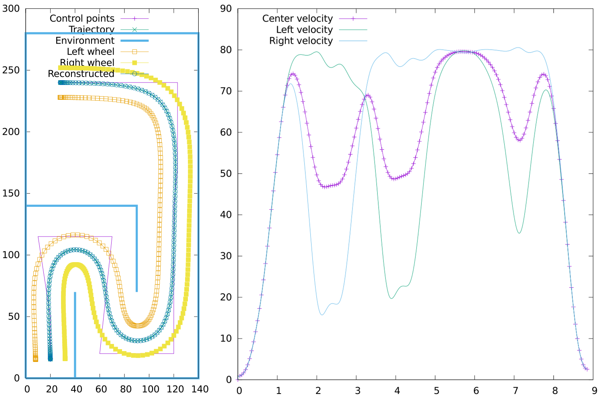

# Path Planner

Simple library for smooth path planning along control points for differential
wheeled robot. Just specify robot width, limit speed and acceleration for the
wheels and you are ready to go! "Enjoy the smoothness of the motion"

This library was initially written for robot 
[Aranka](http://robotikabrno.cz/robotika-brno/projekty/aranka), which competed
at [Robotic Day 2016](http://roboticday.org/2016/). Algorithm for final path
shape was inspired by
[SmoothPlanner](https://github.com/KHEngineering/SmoothPathPlanner), however
whole speed computation is my own work, as the SmoothPathPlanner library does
not compute speed correctly. It does not follow specified speed and acceleration
constraints and also the speed profiles for left and right wheel do not yield
desired robot motion.

# Example output

# Usage

The library is header only and the only dependency is
[Atoms library](https://github.com/yaqwsx/atoms). To compile it you need to use
C++11. For example usage see demo, which allows you to use PathPlanner from
command line.

# Trajectory parameters

Please see declaration of `PathPlanner::Params`, where you can find brief 
description of the parameters.

# Contributing & issues

Feel free to submit issues, enhancement requests and pull requests.
